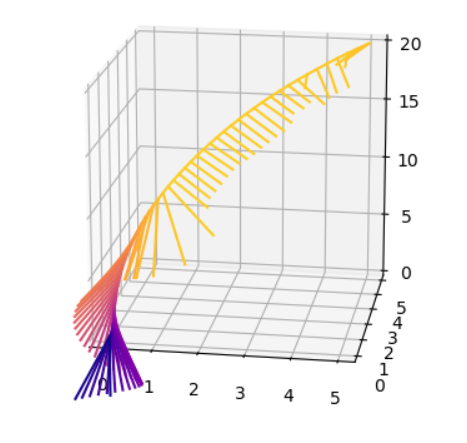
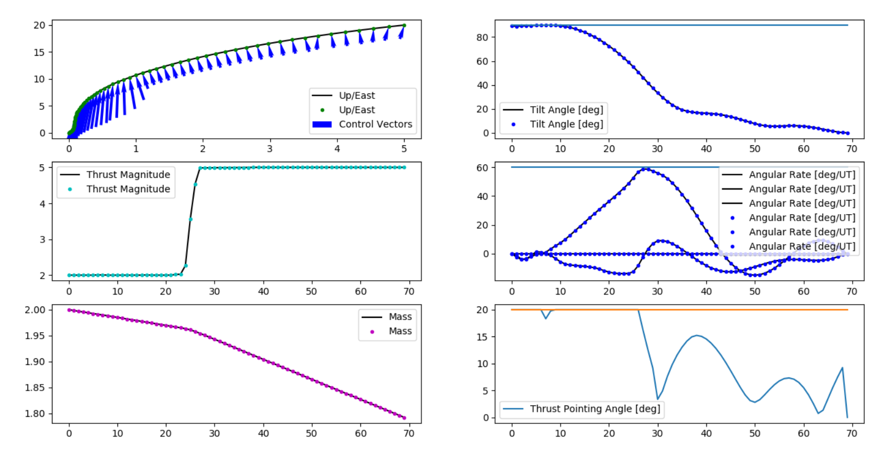

[README_en.md](README_en.md)

# TODO: Landing trajectory optimization in Kerbal Space Program
forked from https://github.com/jonnyhyman/SuccessiveConvexification

目前状态：完成原项目代码的整理，求解器跑通，封装成函数  

Todo：用krpc实现控制游戏里的火箭着陆

# 依赖项
cvxpy                    0.4.11  
[cvxpy-codegen](https://github.com/moehle/cvxpy_codegen)            0.0.1  (用来生成C代码，具体看下面的说明)  
scipy                   1.2.1  
numpy  
matplotlib (用来把结果画成图)  

# 运行测试数据

一共有两种运行方式：直接用cvxpy求解（比较慢，但最简单）和通过cvxpy-codegen生成C代码来求解（比较快，但比较麻烦）。下面是第一种方式直接求解的操作

求解一个示例数据，如果环境配置没问题，程序运行正常，这个数据保证能有最优解
``` powershell
python .\SC_solver.py
```

求解示例数据完成后会自动输出到trajectory文件夹内。运行plot.py结果可视化
``` powershell
cd .\trajectory
python .\plot.py
```




SC_solver.solve已经封装好，可以从别的文件调用：
```python
import SC_solver, SC_params

# 这里用的默认测试数据，可以自行修改
vessel = SC_params.VesselProfile.get_default()
state_initial = SC_params.VesselState.get_default_initial()
state_final =   SC_params.VesselState.get_default_final()

x, u, tf = SC_solver.solve(vessel, state_initial, state_final, use_c=False, verbose=False)
# 返回值：
# x 状态变量 (14 * K)
# u 控制变量 (3  * K)
# tf 最佳飞行时间

```

# 生成C代码

这是第二种运行方式，需要先生成代码

运行 build.bat，自动生成求解器的C代码并编译和安装成python模块 

根据系统环境不同、编译器不同，生成的代码可能会产生意想不到的错误，如果有报错请自行debug 

生成成功后，调用SC_solver.solve的时候把参数里面的use_c改成True就可以改用生成后的代码求解（效率会更高）

也可以运行以下命令来测试生成的代码是否成功。理论上结果和之前直接求解是一样的。在我这里测试出来速度提高到原来的5倍
``` powershell
python .\SC_solver.py codegen
```

# Original Readme

[old/README.md](old/README.md)