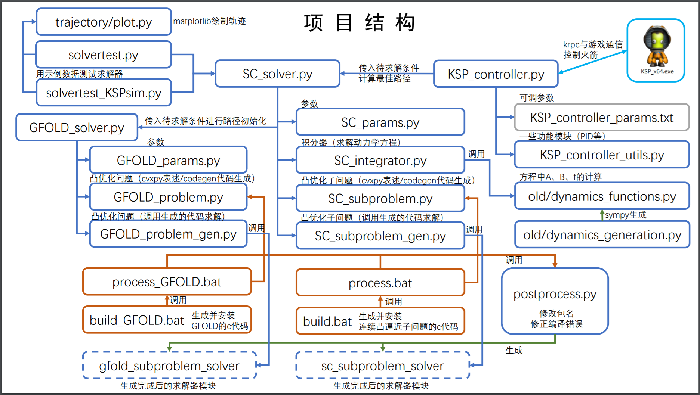
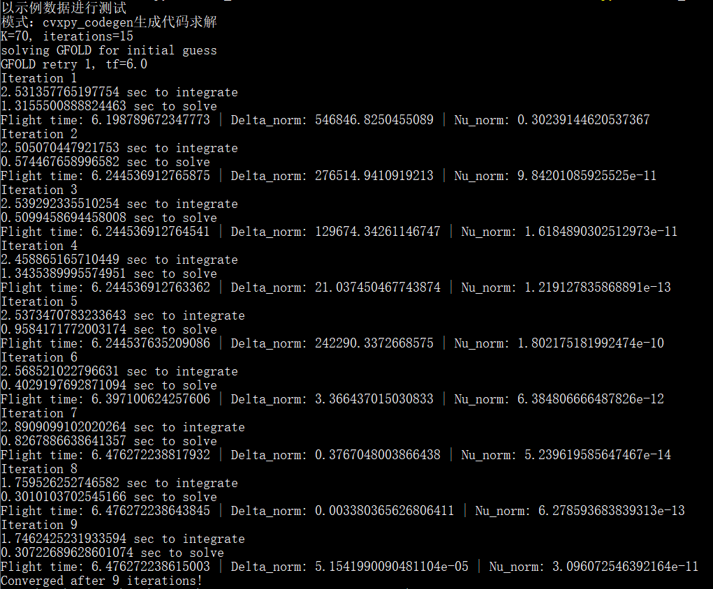
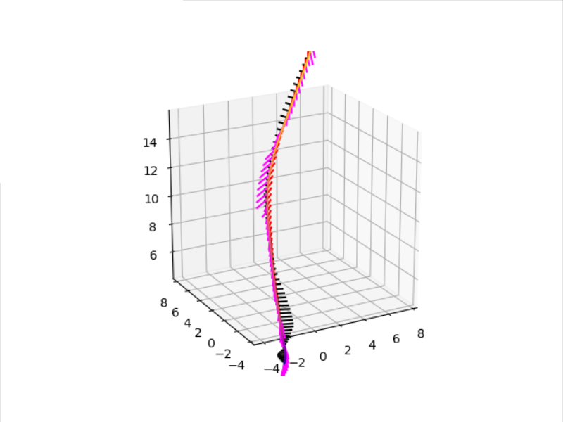
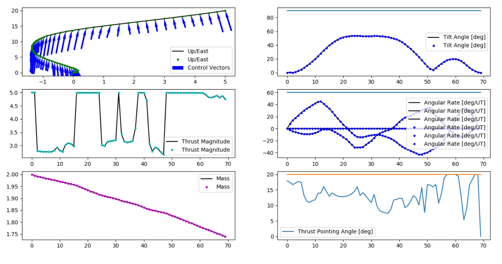

[README_en.md](README_en.md)

# Landing trajectory optimization in Kerbal Space Program
forked from https://github.com/jonnyhyman/SuccessiveConvexification

（结构图中A->B代表A调用B）


# 依赖项
**Python依赖项：**
- cvxpy                    0.4.11   
- [cvxpy-codegen](https://github.com/moehle/cvxpy_codegen)            0.0.1  (用来生成C代码，具体看下面的说明)   
- scipy                   1.2.1   
- numpy   
- matplotlib (用来把结果画成图)    
- krpc  

**KSP依赖Mod：**


- krpc （适用1.8.x的krpc可以在[这里](http://krpc.s3-website-us-east-1.amazonaws.com/deploy/master/1417/)找到）  
- Tundra Exploration  
- KerbalFoundries2
- TweakScale  
- Better Time Warp（推荐，用来开慢速）  

# 运行测试数据

一共有两种运行方式：直接用cvxpy求解（比较慢，有时候不稳定）和通过cvxpy-codegen生成C代码来求解（求解比较快，但生成过程比较麻烦）。下面是第一种方式直接求解的操作

求解一个示例数据，如果环境配置没问题，程序运行正常，这个数据~~保证能有最优解~~
``` powershell
python .\SC_solver.py
```
（有时候ECOS会裂开，如果运行上述程序出现Solver 'ECOS' failed建议直接跳到下面生成C代码的段落，生成的求解器可以更快更稳定地求解）

求解示例数据完成后会自动输出到trajectory文件夹内。运行plot.py结果可视化
``` powershell
cd .\trajectory
python .\plot.py
```


SC_solver.solve是已经封装好的求解函数，可以从别的文件调用：
```python
import SC_solver, SC_params

# 这里用的默认测试数据，可以自行修改
vessel = SC_params.VesselProfile.get_default()
state_initial = SC_params.VesselState.get_default_initial()
state_final =   SC_params.VesselState.get_default_final()

x, u, tf = SC_solver.solve(vessel, state_initial, state_final, use_c=False, verbose=False)
# 返回值：
# x 状态变量 (14 * K)
# u 控制变量 (3  * K)
# tf 最佳飞行时间

```

# 生成C代码

这是第二种运行方式，需要先生成代码

运行 build.bat和build_GFOLD.bat，自动生成求解器的C代码并编译和安装成python模块 

根据系统环境不同、编译器不同，生成的代码可能会产生意想不到的错误，如果有报错请自行debug 

生成成功后，调用SC_solver.solve的时候把参数里面的use_c改成True就可以改用生成后的代码求解（效率会更高）

也可以运行以下命令来测试生成的代码是否成功。理论上结果和之前直接求解是一样的。在我这里测试出来速度提高到原来的5倍

（这个应该大概一定是有解的）
``` powershell
python .\SC_solver.py codegen
```
成功的话会看到类似下图输出：




运行plot.py结果可视化
``` powershell
cd .\trajectory
python .\plot.py

```



# krpc控制器

以上是求解器，接下来是连接到游戏并控制载具

我仿照TundraExploration里面的模型搭了一个测试用载具（Kerbal_Starship.craft）

KSP_controller_starship.py中的代码及参数是专门根据Kerbal_Starship.craft这个载具调整的。如果要用别的载具，有不同的发动机和翼面控制方式，则需要修改源码中相应的翼面控制和发动机控制相关部分，并且还可能需要重新调整各种pid参数。

把飞船放到发射台上，打开游戏内krpc服务器，运行KSP_controller_starship.py，程序会控制飞船自动发射，到一定高度翻过来，肚子朝下，用可动翼面控制姿态；

下落到一定高度后自动暂停游戏开始计算轨迹，计算好后解除暂停，开始按照轨迹下落（此时最好开0.5倍timewarp以免程序运行过慢，导致反应不过来）

成功率还不是很理想，大概在70%吧

# Original Readme

[old/README.md](old/README.md)
